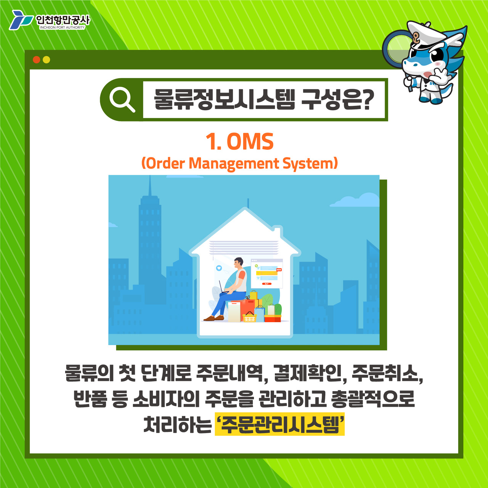
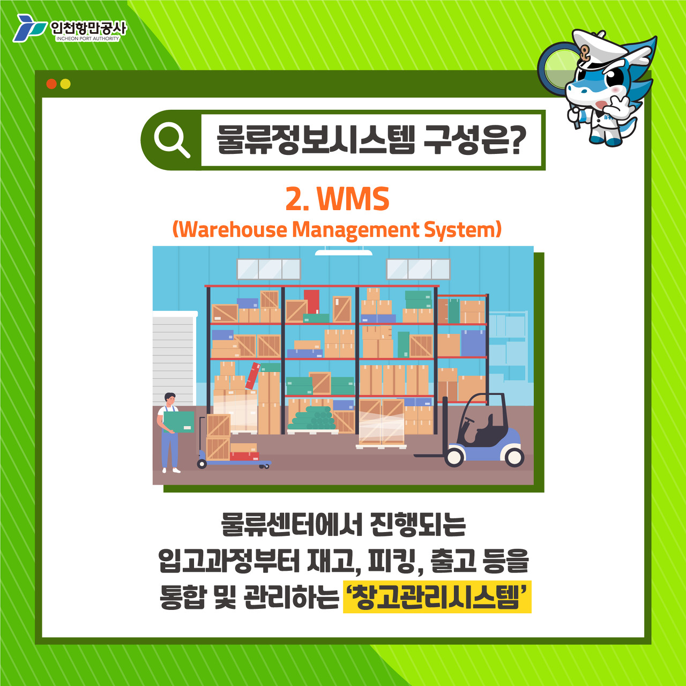
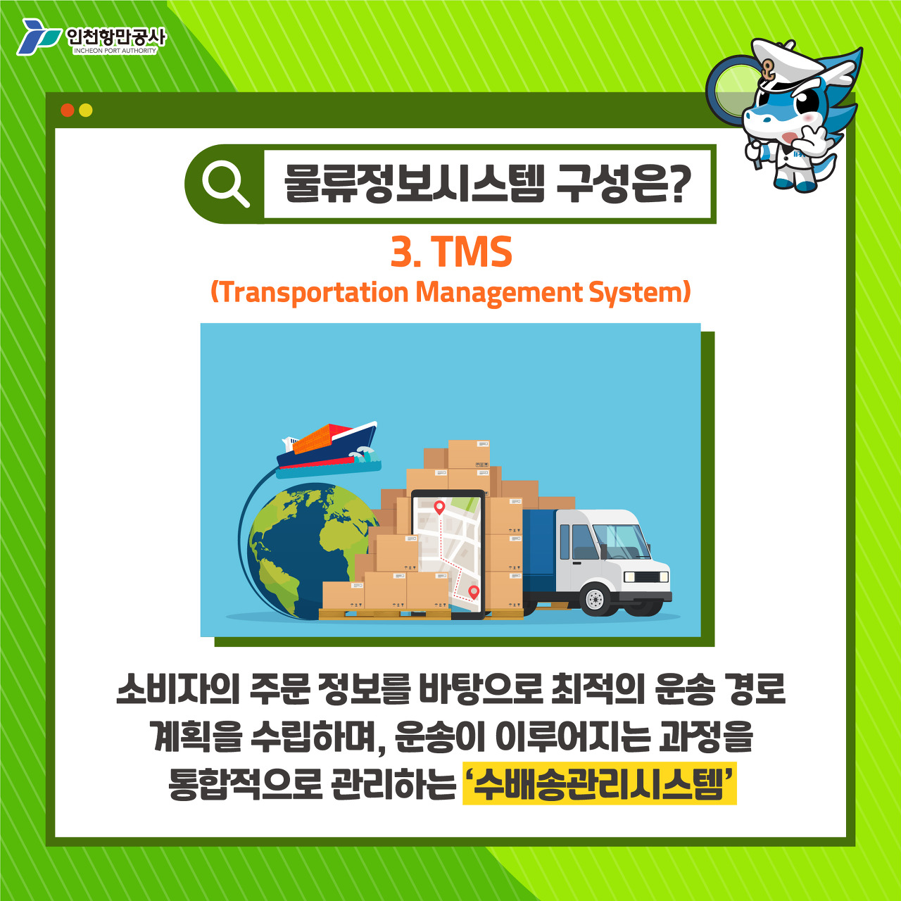
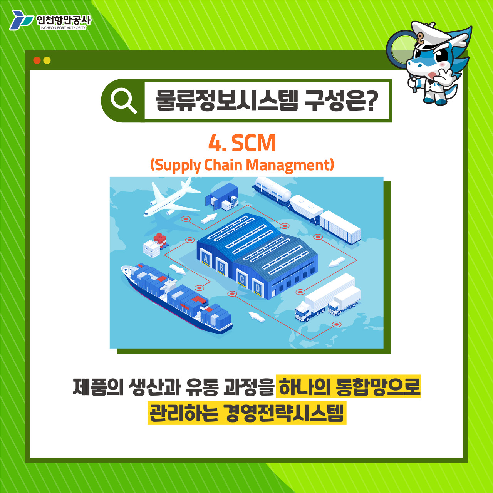

# 물류정보 시스템이란?

[참고-인천항만공사](https://incheonport.tistory.com/6134)

## 물류정보시스템이란?

  
물류정보시스템이란?  
물류정보시스템(Logistics Information Syste, LIS)은  
원재료 구입 및 제품 생산부터 완제품의 유통과 배송에 이르기까지!  
물류의 전 과정을 효율적으로 진행하기 위해 필요한 정보 전달 처리 시스템을 일컫는데요.  
상품 주문, 주문 접수, 제품 발주, 수송 및 배송 등 일련의 과정을 각각 시스템화 또는 전산화 하여 효과적인 물류 활동을 창출해내는 방식입니다.

물류정보시스템 구성은?  
물류정보 시스템은 물류의 단계에 따라 구분되는데요, 크게 OMS(Order Management System),  
WMS(Warehouse Management System),
TMS(Transportation Management System),
SCM(Supply Chain Management)으로 나눌 수 있습니다.

---

## 물류정보시스템 구성은?

### 1. OMS(Order Management System)

  
OMS(Order Management System)  
OMS는 물류가 처음 시작하는 단계로 주문내역, 결제확인, 주문취소, 반품 등  
소비자의 주문을 관리하고 총괄적으로 처리하는 '주문관리시스템'을 말합니다.  
판매자는 OMS에 기록된 데이터를 바탕으로 상품의 재고 파악, 입고 예정일 등을 쉽게 확인할 수 있습니다.

### 2. WMS(Warehouse Management System)

  
WMS는 물류센터에서 진행되는 입고과정부터 재고, 피킹, 출고 등을 통합 및 관리하는 '창고시스템'을 일컫습니다.  
WMS를 통해 보관시설 및 품목별 재고상황을 기록하여 재고의 수량 및-위치 파악 등 효율적으로 물류센터를 관리할 수 있습니다.

### 3. TMS(Transportation Management System)

  
TMS(Tansportation Management System)  
TMS는 소비자의 주문 정보를 바탕으로 최적의 운송 경로 계획을 수립하며,  
운송이 이루어지는 과정을 통합적으로 관리하는 '수배송관리시스템'입니다.  
주문한 물량에 따라 입출하고 지시를 확인하여 운송수단을 지정하고, 화물의 특징에 따라 적절한 운송수단을 배정하는 등 운송 과정이 수월하게 진행될 수 있도록 돕습니다.

### 4. SCM(Supply Chain Management)

  
SCM(Supply Chain Management)  
SCM은 제품의 생산과 유통과정을 하나의 통합망으로 관리하는 경영전략시스템 입니다.  
기업은 SCM을 통해 소비자가 구매한 제품을 원하는 시간과 장소에 제공하여 효율적인 공급망을 구축할 수 있습니다.  
SCM은 주로 OMS, WMS, TMS를 하기 전에 실시합니다.  
공급망관리 경영전략시스템을 구축하여 소비자 만족도를 극대화하면, 기업의 경쟁력을 강화할 수 있습니다.
